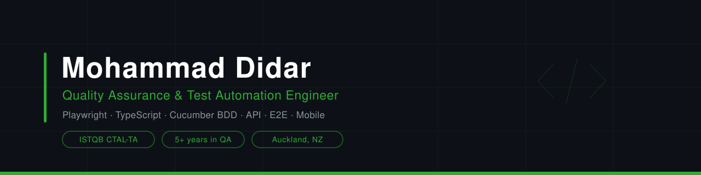

<!-- ═══════════════════════════ HEADER ═══════════════════════════ -->
<div align="center">




<br/>

<a href="https://linkedin.com/in/didarmohammad"></a>
<a href="mailto:didarmd005@gmail.com"></a>
<a href="https://github.com/didarmdd"></a>


<br/>


</div>

---

<!-- ═══════════════════════════ ABOUT ═══════════════════════════ -->

##  About Me

```ts
const didar: QAEngineer = {
  role: "Quality Assurance & Test Automation Engineer",
  experience: "5+ years",
  location: "Auckland, New Zealand",
  certified: ["ISTQB CTAL-TA", "ISTQB CTFL", "AWS Cloud Practitioner"],
  stack: ["Playwright", "TypeScript", "Cucumber BDD", "Postman", "SQL"],
  domains: ["FinTech", "Loan Management", "Core Banking", "E-Commerce", "SaaS", "Mobile"],
  currentlyLearning: ["LLM & AI-assisted testing", "Advanced Playwright patterns"],
  funFact: "I enjoy breaking software before users get the chance to",
  philosophy: "Quality is built in, not tested in.",
};
```

I've spent the last five years making software behave itself. Most of my work sits where automation, APIs and real business logic meet: loan lifecycles, core banking integrations, e-commerce checkouts and mobile apps that can't afford to break.

I like writing automation that actually survives a release cycle, digging through Datadog and Sentry until the root cause gives up, and finding the edge case nobody wrote a ticket for.

<br/>

| | |
|:--|:--|
|  **Currently working on** | QA automation, API testing and end-to-end coverage across fintech and e-commerce |
|  **Looking to collaborate on** | Test automation frameworks, Playwright tooling and open source QA projects |
|  **Interested in** | AI / LLM testing and advanced test automation |
|  **Currently learning** | LLM testing, AI-assisted QA and deeper Playwright patterns |
|  **Ask me about** | Playwright, TypeScript, Cucumber BDD, API testing, SQL and software quality |
|  **Fun fact** | I enjoy breaking software before users get the chance to 😄 |

---

<!-- ═══════════════════════════ TECH STACK ═══════════════════════════ -->

##  Tech Stack

<div align="center">


</div>

<br/>

###  Automation Frameworks


###  Testing Expertise


###  Languages & Technologies


<br/>

<table>
<tr>
<td valign="top" width="50%">

###  API & Test Management


###  Cross-Platform & Debugging


###  Project & Collaboration


</td>
<td valign="top" width="50%">

###  Monitoring & Observability


###  Cloud


###  CI/CD & Version Control


</td>
</tr>
</table>

###  Platforms & Browsers


###  Domain Experience


---

<!-- ═══════════════════════════ WHAT I DO ═══════════════════════════ -->

##  What I Actually Do

<table>
<tr><th width="190">Area</th><th>What that looks like day to day</th></tr>
<tr><td> <b>Automation</b></td><td>UI and API suites in Playwright + TypeScript, Cucumber BDD feature files, page objects, fixtures, parallel runs and CI-friendly reporting</td></tr>
<tr><td> <b>API testing</b></td><td>REST validation in Postman and Bruno, schema and contract checks, auth flows, chained requests, backend data consistency</td></tr>
<tr><td> <b>End-to-end</b></td><td>Full business journeys across web, mobile and backend, including third-party and core banking integrations</td></tr>
<tr><td> <b>Data validation</b></td><td>SQL queries for integrity checks, migration verification and reconciliation between systems</td></tr>
<tr><td> <b>Mobile</b></td><td>iOS and Android on real devices and BrowserStack, responsiveness, device compatibility, cross-platform behaviour</td></tr>
<tr><td> <b>Root cause</b></td><td>Datadog, Sentry and Loggly log analysis, network inspection via Charles Proxy, turning vague bug reports into reproducible steps</td></tr>
<tr><td> <b>Non-functional</b></td><td>Performance, security fundamentals, accessibility and cross-browser coverage</td></tr>
<tr><td> <b>Process</b></td><td>Test strategy, risk-based coverage, defect triage, release readiness, mentoring juniors, refining stories with BAs and devs</td></tr>
</table>
---

<!-- ═══════════════════════════ EXPERIENCE ═══════════════════════════ -->

##  Featured Projects

<table>
<tr><th width="240">Project</th><th>What it is</th><th width="150">Stack</th></tr>
<tr>
  <td><a href="https://github.com/didarmdd/REPO-NAME"><b>Playwright Framework</b></a></td>
  <td>Replace with a one-line description of your automation framework</td>
  <td><code>Playwright</code> <code>TypeScript</code></td>
</tr>
<tr>
  <td><a href="https://github.com/didarmdd/REPO-NAME"><b>API Test Suite</b></a></td>
  <td>Replace with a one-line description of your API testing project</td>
  <td><code>Postman</code> <code>Bruno</code></td>
</tr>
<tr>
  <td><a href="https://github.com/didarmdd/REPO-NAME"><b>BDD Cucumber Project</b></a></td>
  <td>Replace with a one-line description of your BDD project</td>
  <td><code>Cucumber</code> <code>TypeScript</code></td>
</tr>
</table>

---

##  Experience Highlights

<details open>
<summary><b>🏦 QA Engineer · FinTech & Lending Platforms</b> · Auckland, NZ · 2025 to present</summary>

<br/>

End-to-end testing across the full loan lifecycle in a Loan Management System: creation, approval, repayment, arrears, recourse and settlement.

- Built and maintained automated UI and API suites in Playwright and Cucumber with TypeScript and BDD
- Validated Mambu core banking integrations for data accuracy and correct lifecycle event handling
- Used Datadog for log analysis and root cause investigation on transaction failures
- Supported a legacy to modern platform migration, validating data integrity throughout the transition
- Worked in Jira, Confluence and Figma with devs, BAs and designers to sharpen acceptance criteria

`Playwright` `TypeScript` `Cucumber` `Postman` `Bruno` `Mambu` `Datadog` `SQL`

</details>

<details>
<summary><b>📱 QA & Tester · Mobile and Web Applications</b> · 2021 to 2025</summary>

<br/>

Delivered 5+ mobile and web applications for enterprise clients including T-Mobile, Walmart, Walgreens and CVS.

- Cut regression testing time by 20% by introducing Playwright automation
- Lifted defect detection rate by 15% through structured exploratory testing
- Ran iOS and Android testing across real devices and emulators
- Used AWS CloudWatch, QuickSight and Pinpoint for performance monitoring and engagement analytics
- Led and mentored junior testers, owning defect triage and test execution priorities

`Playwright` `Postman` `iOS` `Android` `AWS` `Sentry` `SQL`

</details>

<details>
<summary><b>🧾 Test Analyst · Tax & Revenue Management</b> · 2021</summary>

<br/>

Designed and executed test plans for a government tax and revenue management system with strict regulatory and financial accuracy requirements.

- Identified and drove resolution of 50+ critical defects
- Performed SQL data validation and financial reporting accuracy checks
- Managed test cases and defects in TFS, cutting test planning time by 10%
- Led end-to-end testing for a nationwide rollout

`SQL` `TFS` `Cross-browser` `Regression` `Smoke`

</details>

---

<!-- ═══════════════════════════ IMPACT ═══════════════════════════ -->

##  Impact So Far

<div align="center">

| 📉 Regression Time | 📈 Defect Detection | 🐞 Critical Defects | 🚀 Apps Delivered | 📝 Planning Time |
|:--:|:--:|:--:|:--:|:--:|
| **-20%** | **+15%** | **50+** | **5+** | **-10%** |
| via Playwright automation | via exploratory testing | found and resolved | mobile and web | via better documentation |

</div>

---

<!-- ═══════════════════════════ CERTIFICATIONS ═══════════════════════════ -->

##  Certifications

<div align="center">


<br/>


</div>

---

<!-- ═══════════════════════════ STATS ═══════════════════════════ -->

##  GitHub Stats

<div align="center">


<br/>


</div>

---

<!-- ═══════════════════════════ SNAKE ═══════════════════════════ -->

##  Contribution Snake

<div align="center">

<picture>
  <source media="(prefers-color-scheme: dark)" srcset="https://raw.githubusercontent.com/didarmdd/didarmdd/output/snake-dark.svg" />
  <source media="(prefers-color-scheme: light)" srcset="https://raw.githubusercontent.com/didarmdd/didarmdd/output/snake.svg" />
  
</picture>

</div>

---

<!-- ═══════════════════════════ FOOTER ═══════════════════════════ -->

<div align="center">

##  Let's Connect

Always happy to talk automation frameworks, flaky test horror stories, or anything QA.

<br/>

<a href="https://linkedin.com/in/didarmohammad"></a>
<a href="mailto:didarmd005@gmail.com"></a>

<br/><br/>

<i>If it can be tested, it can be automated. If it can be automated, it should be.</i>

<br/><br/>


</div>
